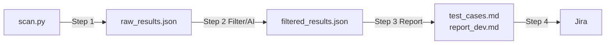
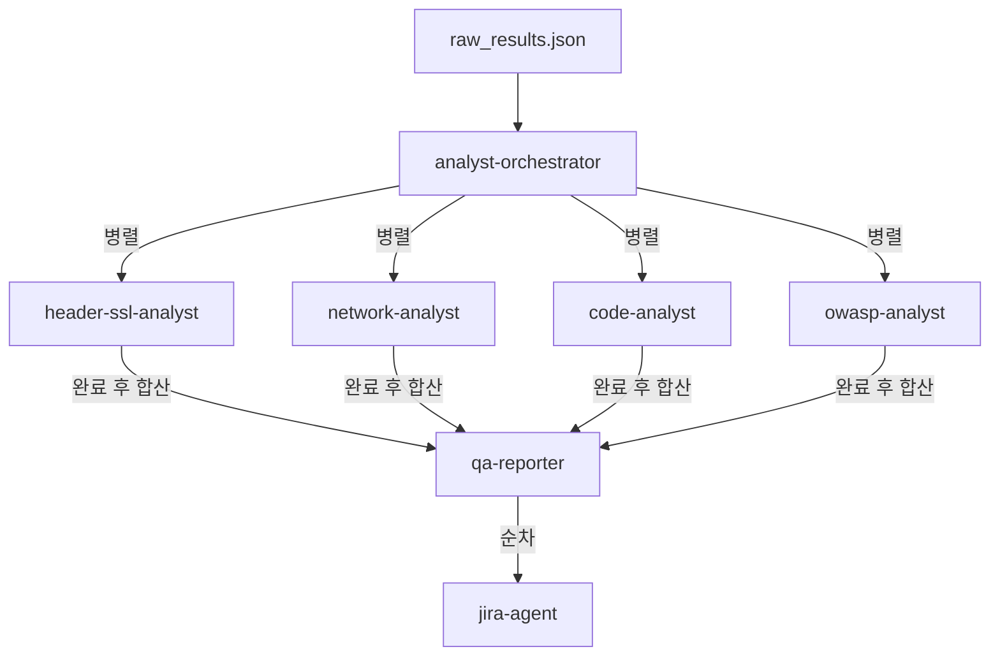
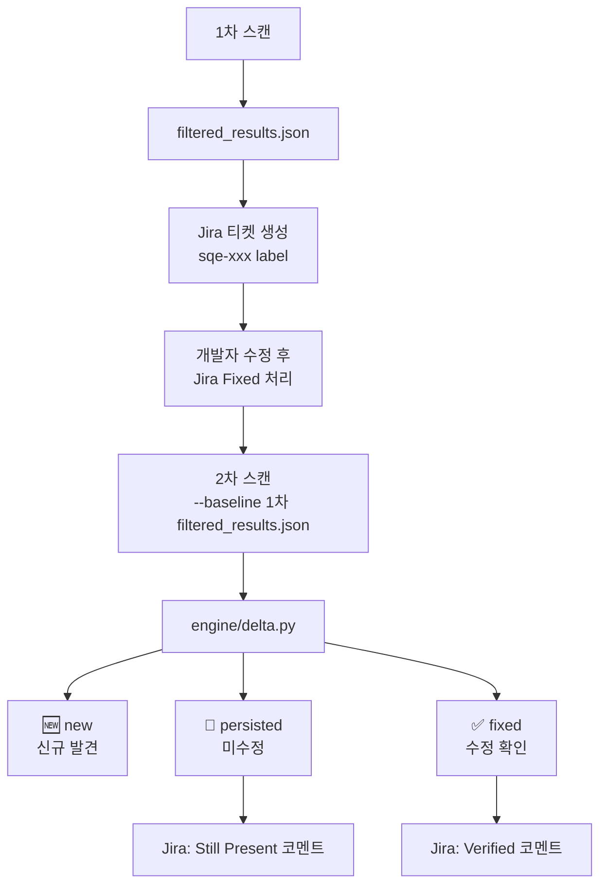
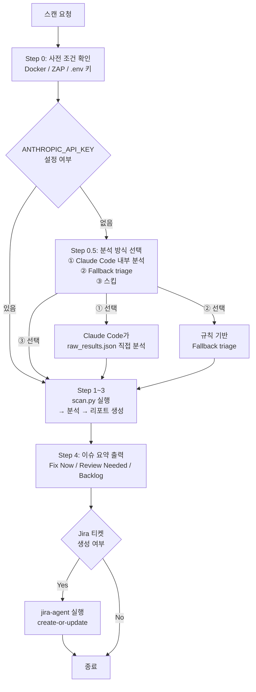

# CLAUDE.md

이 저장소에서 작업할 때 가장 먼저 읽어야 하는 운영 문서다.

---

## 1. Project Overview

Security QA Engine은 보안팀 진단 대체가 아닌 **QA 선제 점검** 도구다.
QA팀이 유효 취약점을 먼저 선별하고 개발팀에 바로 전달 가능한 형태로 정리하는 것이 목적.

**커버 범위:** 웹(헤더/쿠키/TLS/ZAP) · 네트워크(nmap/Shodan) · 서버(기본페이지/관리경로) · DB(dump/credentials) · 코드(semgrep/dependency/secrets)

---

## 2. Document Map

| 문서 | 역할 |
|------|------|
| `README.md` | 프로젝트 소개, 설치, 실행 방법 |
| `CLAUDE.md` | 파이프라인 계약, 인터랙션 규칙, 스키마, 구현 원칙 |
| `.claude/agents/*.md` | 에이전트별 입출력 계약 및 도메인 규칙 |

**읽는 순서:** `README.md` → `CLAUDE.md` → 작업 대상 agent 문서

---

## 3. Pipeline Overview



### 에이전트 병렬 처리 구조



### Step별 담당 파일

| Step | 담당 파일 |
|------|-----------|
| 1. Scan | `scan.py`, `config.py`, `scanner/orchestrator.py`, `scanner/web/*`, `scanner/local/*`, `scanner/normalizer.py` |
| 2. Filter | `engine/ai_filter.py`, `engine/prioritizer.py`, `engine/delta.py` |
| 3. Report | `engine/qa_converter.py`, `reports/markdown.py` |
| 4. Jira | `integrations/jira.py` |

### Delta / Regression 파이프라인



> **운영 원칙:** Delta는 동일 타겟 재스캔에서만 유효하다. 사이트별로 Jira 프로젝트를 분리해 타겟 혼용을 방지한다.

---

## 4. Docker Setup

URL 전체 스캔은 **Docker가 필수**다. nmap · nuclei · ZAP 모두 로컬 바이너리 없이 컨테이너로 실행된다.

### 사용 이미지

| 도구 | 이미지 | 실행 방식 |
|------|--------|-----------|
| nmap | `instrumentisto/nmap` | `docker run --rm` (scan.py 내부 자동 실행) |
| nuclei | `projectdiscovery/nuclei` | `docker run --rm` (scan.py 내부 자동 실행) |
| ZAP | `ghcr.io/zaproxy/zaproxy:stable` | `docker-compose --profile zap up -d` (사전 기동 필요) |

### ZAP 기동

```bash
# ZAP 컨테이너 시작 (URL 스캔 전에 실행)
docker-compose --profile zap up -d

# ZAP 컨테이너 종료
docker-compose --profile zap down
```

### .env ZAP 설정

```env
ZAP_API_KEY=changeme   # docker-compose.yml의 api.key와 일치해야 함
ZAP_PORT=8080          # ZAP 컨테이너 포트 (기본값 8080)
```

### 실행 조건 요약

| 모드 | Docker 필요 여부 |
|------|-----------------|
| `--url` (full) | 필수 — nmap · nuclei · ZAP |
| `--url --skip-zap` | 필수 — nmap · nuclei (ZAP 제외) |
| `--path` (local) | 불필요 — semgrep · pip-audit · detect-secrets 로컬 실행 |
| `--from-filtered` | 불필요 — 리포트 재생성만 수행 |

> preflight에서 `docker info` 응답이 없으면 URL 풀 스캔이 차단된다.

---

## 5. Output Schema

### raw_results.json 주요 필드

`scan_id` · `scan_type` · `target` · `scanned_at` · `scanners_run` · `scanners_failed` · `coverage_status` · `report_confidence` · `findings[]`

각 finding: `id` · `source` · `title` · `severity` · `cvss_score` · `category` · `location` · `description` · `evidence` · `raw{dedup_key, merged_*}`

### filtered_results.json 추가 필드

| 필드 | 값 |
|------|----|
| `priority` | 1(최고) ~ 99(false positive) |
| `false_positive` | true / false |
| `action_status` | `fix_now` / `review_needed` / `backlog` |
| `qa_verifiable` | `qa_verifiable` / `requires_dev_check` / `requires_security_review` |
| `verification_status` | `unverified` / `reproduced` / `needs_manual_check` / `fixed_pending_retest` |
| `evidence_quality` | `strong` / `medium` / `weak` / `manual_check_required` |
| `delta_status` | `new` / `persisted` / `fixed` / `None` |

---

## 6. Engine Behaviors

**Fallback:** `--skip-ai` 또는 AI 실패 시 파이프라인 중단 없이 fallback triage로 진행. API key 미설정 시에는 Claude Code 내부 분석 또는 fallback triage 중 사용자가 선택한다 (§9 Step 0.5 참조).

**Deduplication:** `build_scan_result()` 직전 수행. headers(header signature) · dependency(패키지명) · cve(CVE ID) · 기타(category+location+title). 병합 메타데이터는 `raw.dedup_key`, `raw.merged_*`에 저장.

**False Positive:** Shodan 단순 노출 inventory · low-signal optional header · remediation 없는 info dependency · info 수준 TLS observation → 자동 false positive 처리.

**Coverage/Confidence:** 스캐너 실패 시 `coverage_status` · `report_confidence` · `failed_scanners`를 JSON과 report 상단에 함께 표시.

---

## 7. Reports

**test_cases.md** — QA 직접 사용. Action Status / QA Verifiable / Verification Status / Evidence Quality / Reproduction / Evidence / Fix Suggestion

**report_dev.md** — 개발팀 전달용. Delta Summary(baseline 있을 때) · Severity/Action 통계 · Domain Coverage(Web/Network/Server/DB/Code) · Priority Queue(Fix Now / Review Needed / Backlog) · finding 카드(재현·수정·증거·delta 배지)

---

## 8. Code Rules

- 환경 변수는 `config.py`의 `Config`로 읽는다.
- 로깅은 `utils.logger.get_logger(__name__)`를 사용한다.
- 일부 스캐너 실패 시 partial result를 유지한다.
- 출력 파일은 항상 `output/report/<timestamp>/` 아래 생성한다.
- URL 스캔의 `nmap` · `nuclei`는 Docker 컨테이너로 실행 (로컬 바이너리 불필요).
- 테스트는 `tests/` 아래 유지한다.

---

## 9. Interactive Workflow (Claude 행동 규칙)

사용자가 스캔 요청을 하면 Claude는 아래 순서대로 인터랙티브하게 진행한다.



### Step 0 — 사전 조건 확인 (스캔 실행 전 필수)

스캔 요청을 받으면 **즉시 실행하지 말고** 먼저 아래 항목을 확인한다.

**URL 스캔인 경우 질문:**
```
스캔 전에 아래 사전 조건을 확인할게요.

1. Docker가 현재 실행 중인가요?
2. ZAP 컨테이너가 기동되어 있나요? (skip-zap 원하면 알려주세요)
3. .env에 필요한 키가 설정되어 있나요?
   - ANTHROPIC_API_KEY (AI 필터링 — 없으면 fallback triage로 진행)
   - SHODAN_API_KEY (Shodan 스캔)
   - JIRA_URL / JIRA_USER / JIRA_TOKEN / JIRA_PROJECT_KEY (Jira 연동)
```

**로컬 코드 스캔인 경우 질문:**
```
스캔 전에 아래 사전 조건을 확인할게요.

1. 아래 도구가 설치되어 있나요?
   - semgrep, pip-audit, detect-secrets
2. .env에 필요한 키가 설정되어 있나요?
   - ANTHROPIC_API_KEY (AI 필터링 — 없으면 fallback triage로 진행)
   - JIRA_URL / JIRA_USER / JIRA_TOKEN / JIRA_PROJECT_KEY (Jira 연동)
```

사용자가 미충족 항목을 알려주면 `--skip-zap`, `--skip-ai` 등 적절한 플래그로 조정하거나 설정 방법을 안내한 후 진행한다.

---

### Step 0.5 — ANTHROPIC_API_KEY 미설정 시 Claude Code 분석 여부 확인

스캔 실행 전 또는 스캔 완료 후 `ANTHROPIC_API_KEY`가 설정되어 있지 않으면 **fallback triage로 자동 진행하지 말고** 반드시 아래 질문을 먼저 한다:

```
ANTHROPIC_API_KEY가 설정되지 않았습니다.

AI 분석 방식을 선택해주세요:
1. Claude Code 내부 분석 — Claude Code가 직접 raw_results.json을 읽고 분석·우선순위화 (추천)
2. Fallback triage — 규칙 기반 자동 분류로 진행
3. 스킵 — 분석 없이 raw 결과만 저장
```

사용자가 **1번(Claude Code 내부 분석)**을 선택하면:
- `raw_results.json`을 직접 읽어 모든 findings를 분석한다
- 패키지별 CVE 집계, 우선순위 판단, false positive 식별을 수행한다
- 분석 결과를 `report_dev.md`에 **"Claude Code 분석 요약"** 섹션으로 추가한다
- 즉시 업그레이드 필요 패키지 Top 10, Critical CVE 전체 목록, web.xml 이슈 등을 포함한다

사용자가 **2번(Fallback triage)**을 선택하면 기존 규칙 기반 파이프라인으로 진행한다.

---

### Step 1~3 — 스캔 · 분석 · 리포트

사전 조건 확인 후 정상 파이프라인을 실행한다.

```
scan.py → raw_results.json
    → [병렬] analyst 에이전트들
    → qa-reporter → filtered_results.json + test_cases.md + report_dev.md
```

---

### Step 4 — 리포트 완료 후 이슈 요약 및 Jira 확인

리포트 생성이 완료되면:

1. **이슈 요약을 먼저 보여준다** — 아래 형식으로 인라인 요약:
   ```
   스캔 완료. 주요 결과 요약:

   - Fix Now: N건 (Critical/High)
   - Review Needed: N건
   - Backlog: N건
   - False Positive 제외: N건

   주요 이슈:
   - [severity] 제목 — 위치
   - ...
   ```

2. **Jira 티켓 생성 여부를 묻는다:**
   ```
   Jira에 티켓을 생성할까요?
   (false positive 제외, Fix Now + Review Needed 대상으로 create-or-update 진행)
   ```

3. 사용자가 Yes면 `jira-agent` 실행, No면 종료.

---

## 10. Validation

변경 후 반드시 통과해야 하는 범위: normalizer · prioritizer · qa_converter · markdown · delta · preflight · scan flow · network/server/db scanners · Jira create-or-update

```bash
python -m pytest tests/ -q   # 현재 기준 96개 전체 통과 상태
```
