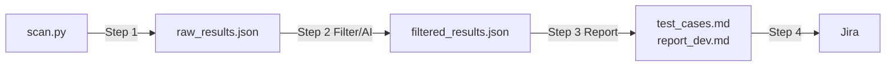
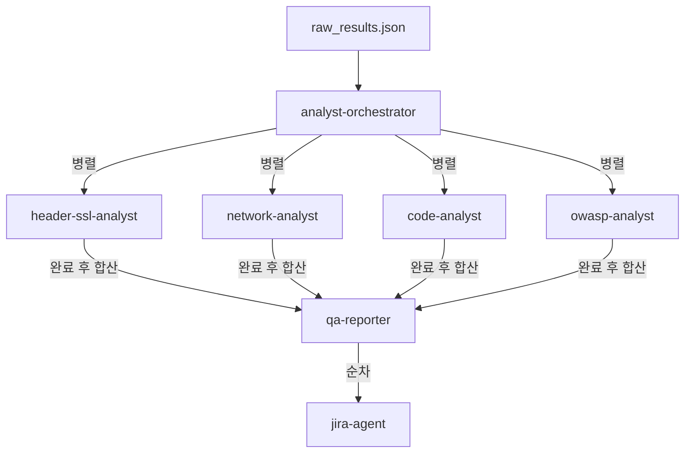
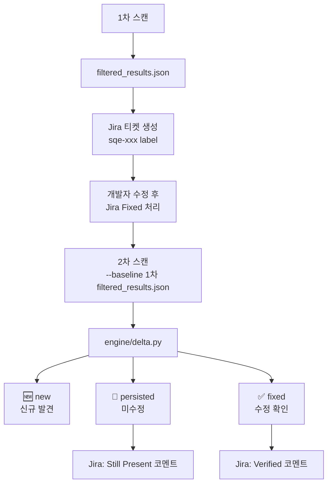

# Security QA Engine

보안 스캐너는 대량의 결과를 출력하지만 맥락이 없다.
규칙 기반 필터링은 알려진 패턴은 처리할 수 있지만, 경로의 중요도, 여러 finding 간의 연관성, "지금 바로 수정 가능한가"에 대한 판단은 하지 못한다.
이 판단이 필요한 지점이 정확히 LLM 추론이 정적 규칙을 앞서는 영역이며, 실제 스캔에서 **92.8%의 노이즈를 제거한 근거**다.

Security QA Engine은 보안팀의 정밀 진단을 대체하는 도구가 아니다.
QA팀이 보안팀 이전 단계에서 유효 취약점을 먼저 선별하고, 재현 가능하고 개발 전달 가능한 형태로 정리해서 **개발팀과 보안팀의 리소스를 줄이는 것**이 목적이다.

---

## Pipeline



---

## Multi-Agent Architecture

Step 2의 Filter/AI 단계는 단일 분석기가 아니라 목적별로 분리된 에이전트가 병렬로 동작한다.



| 에이전트 | 역할 |
|---------|------|
| `analyst-orchestrator` | finding 성격에 따라 하위 에이전트로 분배 |
| `header-ssl-analyst` | 보안 헤더 · 쿠키 · TLS 해석 |
| `network-analyst` | 포트 노출 · Shodan · 외부 공격면 판단 |
| `code-analyst` | semgrep · 의존성 CVE · 시크릿 해석 |
| `owasp-analyst` | OWASP Top 10 분류 및 웹 취약점 맥락화 |
| `qa-reporter` | filtered_results.json + test_cases.md + report_dev.md 생성 |
| `jira-agent` | Jira create-or-update · delta 코멘트 |

각 에이전트는 입력 · 출력 · 실행 조건이 명시된 자기완결형 모듈로 `.claude/agents/`에 정의되어 있다.

---

## AI Filtering Effect

AI가 실제로 판단한 URL 스캔 기준 수치다.
스캐너는 맥락 없이 모든 결과를 출력한다. AI는 경로 중요도, finding 간 연관성, 수정 가능성을 종합해 actionable 여부를 판단한다.

### URL Scan — testfire.net

| 단계 | 건수 |
|------|------|
| Raw findings (스캐너 6개 전체 출력) | 224 |
| False positive 자동 제거 | 208 |
| **Actionable findings** | **16** |
| └ Fix Now (즉시 수정) | 9 |
| └ Review Needed | 4 |
| └ Backlog | 3 |

> 스캐너 출력 224건 중 208건 자동 제거. QA가 실제로 처리해야 할 건수는 16건으로 압축 — **노이즈 92.8% 제거**.

---

## Current Scope

### URL Scanners (`--url`)

| 스캐너 | 설명 | 실행 방식 |
|--------|------|----------|
| `headers` | 보안 헤더 / 쿠키 속성 | Python |
| `db` | DB dump/backup 파일 노출 | Python |
| `server` | 관리자 경로 / 민감 파일 노출 | Python |
| `network` | 포트/서비스 노출 (nmap) | Docker |
| `ssl_labs` | TLS 설정 분석 | Python |
| `shodan` | 외부 노출 정보 | Python |
| `nuclei` | 웹 취약점 자동 탐지 | Docker |
| `zap` | 웹 크롤링 + 취약점 스캔 | Docker |

### Local Scanners (`--path`)

| 스캐너 | 설명 | 실행 방식 |
|--------|------|----------|
| `semgrep` | 정적 코드 분석 | Local |
| `dependency` | 의존성 취약점 (pip-audit) | Local |
| `secrets` | 시크릿 / 자격증명 탐지 | Local |

### WAR / SCA Scanners (`--war`)

| 스캐너 | 설명 | 실행 방식 |
|--------|------|----------|
| `grype` | CVE 취약점 (JAR/WEB-INF/lib) | Docker |
| `webxml` | web.xml 보안 설정 점검 | Python |

### Detection Coverage

- **웹 보안** — 보안 헤더, 쿠키 속성, TLS 설정, ZAP/nuclei 기반 웹 취약점
- **네트워크 보안** — nmap 포트/서비스 노출, 위험 서비스 노출, DB 포트 노출, Shodan 외부 노출
- **서버 보안** — 기본 페이지 노출, 관리자 경로 노출, 민감 파일 노출, `Server`/`X-Powered-By` 정보노출
- **DB 보안** — DB dump/backup 파일 노출, DB connection string 노출, DB 자격증명 노출
- **코드/의존성** — semgrep 정적 분석, 의존성 CVE, 시크릿 탐지
- **WAR/SCA** — JAR 라이브러리 CVE (grype), web.xml 보안 설정 (HTTPS 강제, 쿠키 보안)

### Delta / Regression

- `--baseline` 옵션으로 이전 스캔 결과와 비교
- `dedup_key` 기준으로 finding 상태 분류: `new` / `persisted` / `fixed`
- `report_dev.md` 상단에 Delta 요약 자동 반영
- Jira 티켓에 "Verified" / "Still Present" 코멘트 자동 추가

> **주의:** Delta 비교는 동일 타겟의 재스캔에서만 유효하다.
> 사이트별로 Jira 프로젝트를 분리해서 운영하면 타겟 혼용 없이 정확한 비교가 가능하다.

---

## Scan Results Example

### WAR/SCA Scan — WEB-INF

CVE 데이터베이스 기반 스캔은 근거가 명확하므로 AI 필터링 없이 전량 actionable로 분류된다.
우선순위 · action status · evidence quality 메타데이터는 동일하게 적용된다.

| 단계 | 건수 |
|------|------|
| Raw findings (grype + webxml) | 225 |
| **Actionable findings** | **225** |
| └ Fix Now (Critical/High CVE) | 140 |
| └ Review Needed | 78 |
| └ Backlog | 7 |

> Critical 37건 · High 103건이 즉시 개발팀 전달 대상으로 분류됨.
> JAR 라이브러리 단위로 CVE가 집계되어 패키지별 업그레이드 우선순위를 제공한다.

---

## Output

기본 출력 디렉터리:

```text
output/report/<timestamp>/
```

| 파일 | 대상 |
|------|------|
| `raw_results.json` | 파이프라인 내부 |
| `filtered_results.json` | Jira 연동 · 재분석 |
| `test_cases.md` | QA 직접 사용 |
| `report_dev.md` | 개발팀 전달 |

---

## Engine Design

### AI 분석 / Fallback

AI를 신뢰하되 맹신하지 않는다. API 키 미설정 · 호출 실패 · `--skip-ai` 어떤 상황에서도 파이프라인이 중단되지 않는다.

| 상황 | 동작 |
|------|------|
| `ANTHROPIC_API_KEY` 설정됨 | AI 필터링 (`engine/ai_filter.py`) |
| `ANTHROPIC_API_KEY` 미설정 (Claude Code 사용 시) | Claude Code 내부 분석 또는 fallback triage 중 선택 |
| `--skip-ai` 또는 AI 호출 실패 | Fallback triage (규칙 기반) |

어떤 경우에도 `filtered_results.json`, `report_dev.md`, `test_cases.md`는 생성된다.

### Deduplication

스캐너가 여러 개이면 동일 취약점이 중복 출력된다. `build_scan_result()` 직전에 소스별 기준으로 병합한다.

- `headers` — header signature 기준
- `dependency` / `cve` — 패키지명 / CVE ID 기준
- 기타 — `category + location + normalized title`

병합 메타데이터는 `raw.merged_sources`, `raw.merged_ids`, `raw.merged_count`, `raw.dedup_key`에 저장된다.

### False Positive Rule Pack

근거가 약한 항목은 AI 판단 이전에 규칙으로 먼저 걷어낸다. AI 토큰 낭비를 줄이고 판단 정확도를 높인다.

- Shodan 단순 exposure inventory
- low severity optional header (Permissions-Policy, Referrer-Policy 등)
- remediation path 없는 info dependency
- info 수준 TLS observation

### Coverage / Confidence

스캐너 일부가 실패해도 partial result를 유지한다. `coverage_status`(partial/complete) · `report_confidence`(low/medium/high)가 JSON과 report 상단에 함께 표시되어 결과 신뢰도를 명시한다.

---

## Output Schema

`filtered_results.json`의 finding에는 아래 필드가 포함된다.

| 필드 | 값 |
|------|----|
| `priority` | 1(최고) ~ 99(false positive) |
| `false_positive` | `true` / `false` |
| `action_status` | `fix_now` / `review_needed` / `backlog` |
| `qa_verifiable` | `qa_verifiable` / `requires_dev_check` / `requires_security_review` |
| `verification_status` | `unverified` / `reproduced` / `needs_manual_check` / `fixed_pending_retest` |
| `evidence_quality` | `strong` / `medium` / `weak` / `manual_check_required` |
| `delta_status` | `new` / `persisted` / `fixed` / `null` |

---

## Setup

### Python

```powershell
python -m venv .venv
.venv\Scripts\Activate.ps1
pip install -r requirements.txt
```

### Environment

```powershell
Copy-Item .env.example .env
```

| 변수 | 필수 | 설명 |
|------|------|------|
| `ANTHROPIC_API_KEY` | 선택 | AI 필터링. 없으면 Claude Code 내부 분석 또는 fallback triage로 진행 |
| `SHODAN_API_KEY` | 선택 | Shodan 외부 노출 스캔 |
| `JIRA_URL` | 선택 | Jira 연동 |
| `JIRA_USER` | 선택 | Jira 연동 |
| `JIRA_TOKEN` | 선택 | Jira 연동 |
| `JIRA_PROJECT_KEY` | 선택 | Jira 프로젝트 키 |

### Runtime Prerequisites

| 모드 | 필요 도구 |
|------|----------|
| `--url` (full) | Docker Desktop — nmap · nuclei · ZAP 컨테이너 |
| `--url --skip-zap` | Docker Desktop — nmap · nuclei 컨테이너 |
| `--path` (local) | `semgrep`, `pip-audit`, `detect-secrets` |
| `--war` | Docker Desktop — grype 컨테이너 |
| `--from-filtered` | 불필요 |

### ZAP 기동 (URL 풀 스캔 시)

```bash
docker-compose --profile zap up -d
docker-compose --profile zap down
```

---

## Usage

### URL Scan

```powershell
python scan.py --url https://example.com
```

### URL Scan Without ZAP / nuclei

```powershell
python scan.py --url https://example.com --skip-zap
```

### URL Scan Without AI

```powershell
python scan.py --url https://example.com --skip-ai
```

### Local Code Scan

```powershell
python scan.py --path .\my-project
```

### WAR / WEB-INF SCA Scan

```powershell
python scan.py --war .\app.war
python scan.py --war .\WEB-INF
```

### Generate Reports From Existing Filtered Output

```powershell
python scan.py --from-filtered .\output\report\<timestamp>\filtered_results.json --skip-jira
```

### Regression Scan (Delta 비교)

이전 스캔 결과를 baseline으로 지정하면 수정 여부를 자동으로 검증한다.

```powershell
python scan.py --url https://example.com --baseline .\output\report\<prev_timestamp>\filtered_results.json
python scan.py --from-filtered .\output\report\<timestamp>\filtered_results.json --baseline .\output\report\<prev_timestamp>\filtered_results.json
```



> Delta 비교는 **같은 타겟의 재스캔**에서만 의미가 있다.
> 서로 다른 사이트를 비교하면 location이 달라 key가 일치하지 않으므로 전부 `new`로 분류된다.

---

## Testing

```bash
python -m pytest tests/ -q
```

115개 테스트 전체 통과.
