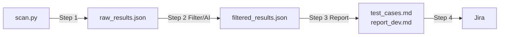
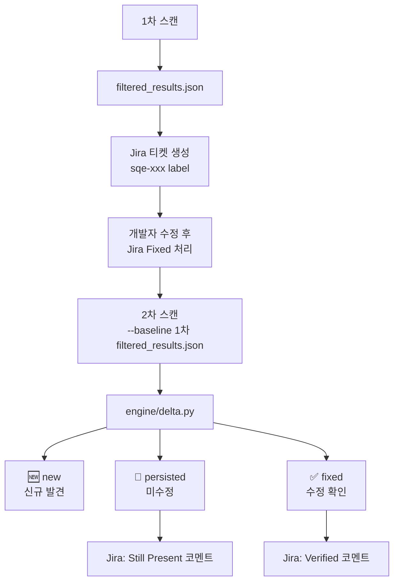

# Security QA Engine

Security QA Engine은 보안팀의 정밀 진단을 대체하는 도구가 아니다.
목표는 QA팀이 보안팀 이전 단계에서 최대한 많은 유효 취약점을 먼저 찾아내고,
재현 가능하고 개발 전달 가능한 형태로 정리해서 개발팀과 보안팀의 리소스를 줄이는 것이다.

즉, 이 프로젝트는 단순 스캐너 모음이 아니라 다음 역할을 수행해야 한다.

- 웹사이트 주소를 입력하면 기본적인 종합 보안 점검을 실행한다
- QA가 직접 검증 가능한 취약점을 최대한 많이 선별한다
- 오탐, 중복, 재현 불가 결과를 줄인다
- 개발팀이 바로 수정할 수 있도록 재현 절차와 수정 가이드를 제공한다
- 보안팀은 더 깊은 진단과 고위험 분석에 집중할 수 있게 한다

## Pipeline



## Current Scope

### URL Scanners (`--url`)

| 스캐너 | 설명 | 실행 방식 |
|--------|------|----------|
| `headers` | 보안 헤더 / 쿠키 속성 | Python |
| `db` | DB dump/backup 파일 노출 | Python |
| `server` | 관리자 경로 / 민감 파일 노출 | Python |
| `network` | 포트/서비스 노출 (nmap) | Docker |
| `ssl_labs` | TLS 설정 분석 | Python |
| `shodan` | 외부 노출 정보 | Python |
| `nuclei` | 웹 취약점 자동 탐지 | Docker |
| `zap` | 웹 크롤링 + 취약점 스캔 | Docker |

### Local Scanners (`--path`)

| 스캐너 | 설명 | 실행 방식 |
|--------|------|----------|
| `semgrep` | 정적 코드 분석 | Local |
| `dependency` | 의존성 취약점 (pip-audit) | Local |
| `secrets` | 시크릿 / 자격증명 탐지 | Local |

### WAR / SCA Scanners (`--war`)

| 스캐너 | 설명 | 실행 방식 |
|--------|------|----------|
| `grype` | CVE 취약점 (JAR/WEB-INF/lib) | Docker |
| `webxml` | web.xml 보안 설정 점검 | Python |

### Detection Coverage

- **웹 보안** — 보안 헤더, 쿠키 속성, TLS 설정, ZAP/nuclei 기반 웹 취약점
- **네트워크 보안** — nmap 포트/서비스 노출, 위험 서비스 노출, DB 포트 노출, Shodan 외부 노출
- **서버 보안** — 기본 페이지 노출, 관리자 경로 노출, 민감 파일 노출, `Server`/`X-Powered-By` 정보노출
- **DB 보안** — DB dump/backup 파일 노출, DB connection string 노출, DB 자격증명 노출
- **코드/의존성** — semgrep 정적 분석, 의존성 CVE, 시크릿 탐지
- **WAR/SCA** — JAR 라이브러리 CVE (grype), web.xml 보안 설정 (HTTPS 강제, 쿠키 보안)

### Triage And Delivery

- AI filtering (ANTHROPIC_API_KEY 설정 시) 또는 Claude Code 내부 분석 / fallback triage
- deduplication
- false positive rule pack
- evidence quality scoring
- priority / action status / QA verifiable metadata
- Jira create-or-update

### Delta / Regression

- `--baseline` 옵션으로 이전 스캔 결과와 비교
- `dedup_key` 기준으로 finding 상태 분류: `new` / `persisted` / `fixed`
- `report_dev.md` 상단에 Delta 요약 자동 반영
- Jira 티켓에 "Verified" / "Still Present" 코멘트 자동 추가

> **주의:** Delta 비교는 동일 타겟의 재스캔에서만 유효하다.
> 사이트별로 Jira 프로젝트를 분리해서 운영하면 타겟 혼용 없이 정확한 비교가 가능하다.

## Output

기본 출력 디렉터리:

```text
output/report/<timestamp>/
```

생성 파일:

- `raw_results.json`
- `filtered_results.json`
- `report_dev.md`
- `test_cases.md`

## Setup

### Python

```powershell
python -m venv .venv
.venv\Scripts\Activate.ps1
pip install -r requirements.txt
```

### Environment

```powershell
Copy-Item .env.example .env
```

| 변수 | 필수 | 설명 |
|------|------|------|
| `ANTHROPIC_API_KEY` | 선택 | AI 필터링. 없으면 Claude Code 내부 분석 또는 fallback triage로 진행 |
| `SHODAN_API_KEY` | 선택 | Shodan 외부 노출 스캔 |
| `JIRA_URL` | 선택 | Jira 연동 |
| `JIRA_USER` | 선택 | Jira 연동 |
| `JIRA_TOKEN` | 선택 | Jira 연동 |
| `JIRA_PROJECT_KEY` | 선택 | Jira 프로젝트 키 |

### Runtime Prerequisites

| 모드 | 필요 도구 |
|------|----------|
| `--url` (full) | Docker Desktop — nmap · nuclei · ZAP 컨테이너 |
| `--url --skip-zap` | Docker Desktop — nmap · nuclei 컨테이너 |
| `--path` (local) | `semgrep`, `pip-audit`, `detect-secrets` |
| `--war` | Docker Desktop — grype 컨테이너 |
| `--from-filtered` | 불필요 |

### ZAP 기동 (URL 풀 스캔 시)

```bash
# ZAP 컨테이너 시작
docker-compose --profile zap up -d

# ZAP 컨테이너 종료
docker-compose --profile zap down
```

## Usage

### URL Scan

```powershell
python scan.py --url https://example.com
```

### URL Scan Without ZAP / nuclei

```powershell
python scan.py --url https://example.com --skip-zap
```

### URL Scan Without AI

```powershell
python scan.py --url https://example.com --skip-ai
```

### Local Code Scan

```powershell
python scan.py --path .\my-project
```

### WAR / WEB-INF SCA Scan

```powershell
python scan.py --war .\app.war
python scan.py --war .\WEB-INF
```

### Generate Reports From Existing Filtered Output

```powershell
python scan.py --from-filtered .\output\report\<timestamp>\filtered_results.json --skip-jira
```

### Regression Scan (Delta 비교)

이전 스캔 결과를 baseline으로 지정하면 수정 여부를 자동으로 검증한다.

```powershell
python scan.py --url https://example.com --baseline .\output\report\<prev_timestamp>\filtered_results.json
python scan.py --from-filtered .\output\report\<timestamp>\filtered_results.json --baseline .\output\report\<prev_timestamp>\filtered_results.json
```



> Delta 비교는 **같은 타겟의 재스캔**에서만 의미가 있다.
> 서로 다른 사이트를 비교하면 location이 달라 key가 일치하지 않으므로 전부 `new`로 분류된다.

## Filtered Finding Fields

`filtered_results.json`의 finding에는 아래 필드가 포함된다.

| 필드 | 값 |
|------|----|
| `priority` | 1(최고) ~ 99(false positive) |
| `false_positive` | `true` / `false` |
| `action_status` | `fix_now` / `review_needed` / `backlog` |
| `qa_verifiable` | `qa_verifiable` / `requires_dev_check` / `requires_security_review` |
| `verification_status` | `unverified` / `reproduced` / `needs_manual_check` / `fixed_pending_retest` |
| `evidence_quality` | `strong` / `medium` / `weak` / `manual_check_required` |
| `delta_status` | `new` / `persisted` / `fixed` / `null` |

## Current Behavior

### AI 분석 / Fallback

`ANTHROPIC_API_KEY` 설정 여부에 따라 분석 방식이 결정된다.

| 상황 | 동작 |
|------|------|
| `ANTHROPIC_API_KEY` 설정됨 | AI 필터링 (`engine/ai_filter.py`) |
| `ANTHROPIC_API_KEY` 미설정 (Claude Code 사용 시) | Claude Code 내부 분석 또는 fallback triage 중 선택 |
| `--skip-ai` 또는 AI 호출 실패 | Fallback triage (규칙 기반) |

어떤 경우에도 `filtered_results.json`, `report_dev.md`, `test_cases.md`는 생성된다.

### Deduplication

`build_scan_result()` 직전에 finding deduplication이 수행된다.

- `headers` — header signature 기준
- `dependency` / `cve` — 패키지명 / CVE ID 기준
- 기타 — `category + location + normalized title`

병합 메타데이터는 `raw.merged_sources`, `raw.merged_ids`, `raw.merged_count`, `raw.dedup_key`에 저장된다.

### False Positive Rule Pack

아래 항목은 자동으로 false positive 처리된다.

- Shodan 단순 exposure inventory
- low severity optional header (Permissions-Policy, Referrer-Policy 등)
- remediation path 없는 info dependency
- info 수준 TLS observation

### Coverage / Confidence

스캐너 실패 시 `coverage_status`(partial/complete)와 `report_confidence`(low/medium/high)가
JSON 및 report 상단에 함께 표시된다.

## Testing

```bash
python -m pytest tests/ -q
```

## Positioning

이 프로젝트는 보안팀용 메인 진단 툴이 아니라,
QA팀이 먼저 유효 취약점을 선별하고 개발팀 전달 품질을 높이기 위한 보안 QA 엔진이다.

웹 보안에만 머무르지 않고, 네트워크/서버/DB 노출 징후, 소스코드 정적 분석, WAR SCA까지
포함하는 종합 보안 점검 도구로 확장된 상태다.
